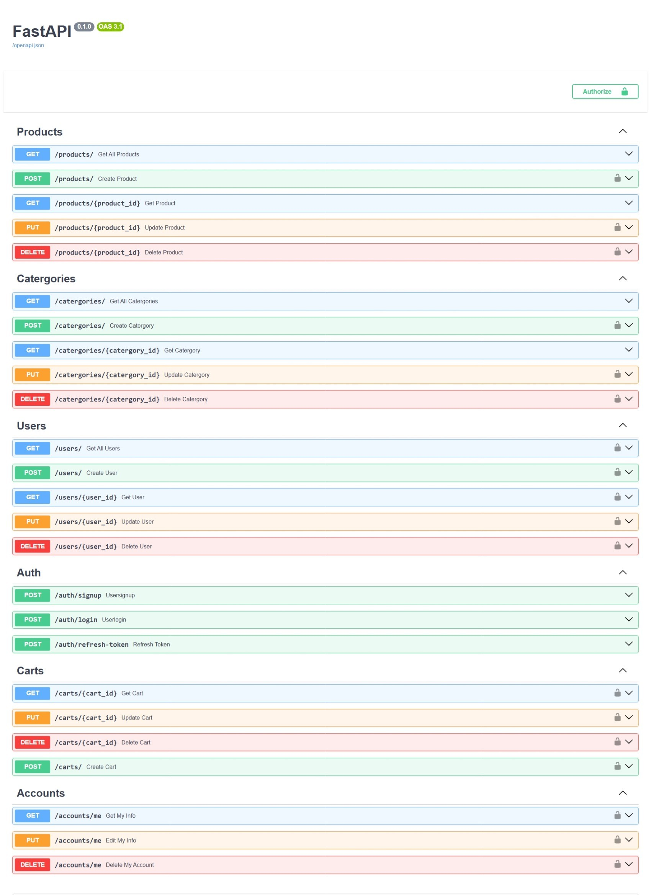

# FastAPI E-Commerce API

A RESTful API for an e-commerce application built with FastAPI, providing endpoints for product management, user authentication, shopping carts, and more.

## Features

- **Product Endpoints:**
	- Comprehensive CRUD operations for managing product details, covering creation, retrieval, updating, and deletion.
- **User Authentication:**
	- Implementation of secure user authentication using JWT (JSON Web Token) for robust access control and identity verification.
- **Cart Management:**
	- Robust operations for managing shopping carts, empowering users to effortlessly add, remove, or update items in their carts.
- **Search and Filter:**
	- Implementation of advanced search and filter functionalities to elevate the product browsing experience, allowing users to find specific information efficiently.
- **Account Management:**
	- User-friendly operations for managing user accounts, enabling users to retrieve, update, or delete their account information.
- **Swagger / FastAPI Integration:**
	- Seamless integration of Swagger UI or ReDoc for comprehensive API documentation. This ensures developers have clear and accessible documentation to understand and utilize the API effectively.

## Technologies Used

- **FastAPI:** 
	- A modern, fast web framework for building APIs with Python 3.7+ based on standard Python type hints.
- **PostgreSQL:** 
	- A powerful open-source relational database management system used for data storage.
- **Supabase:** 
	- Utilizing Supabase for its real-time database capabilities and other features.
- **JWT Authentication:** 
	- Implementing JSON Web Token authentication for secure user authentication.
- **Pydantic:** 
	- A data validation and settings management library for Python, often used with FastAPI.
- **Uvicorn:** 
	- A lightweight ASGI server that serves FastAPI applications. It is used for running FastAPI applications in production.
- **SQLAlchemy:** 
	- An SQL toolkit and Object-Relational Mapping (ORM) library for Python, useful for database interactions.


## API Endpoints

### Products
| Method | Endpoint | Description |
|--------|----------|-------------|
| `GET` | `/products/` | Get all products |
| `POST` | `/products/` | Create a new product |
| `GET` | `/products/{product_id}` | Get specific product |
| `PUT` | `/products/{product_id}` | Update product |
| `DELETE` | `/products/{product_id}` | Delete product |

### Categories
| Method | Endpoint | Description |
|--------|----------|-------------|
| `GET` | `/catergories/` | Get all categories |
| `POST` | `/catergories/` | Create a new category |
| `GET` | `/catergories/{category_id}` | Get specific category |
| `PUT` | `/catergories/{category_id}` | Update category |
| `DELETE` | `/catergories/{category_id}` | Delete category |

### Users
| Method | Endpoint | Description |
|--------|----------|-------------|
| `GET` | `/users/` | Get all users |
| `POST` | `/users/` | Create a new user |
| `GET` | `/users/{user_id}` | Get specific user |
| `PUT` | `/users/{user_id}` | Update user |
| `DELETE` | `/users/{user_id}` | Delete user |

### Authentication
| Method | Endpoint | Description |
|--------|----------|-------------|
| `POST` | `/auth/signup` | User registration |
| `POST` | `/auth/login` | User login |
| `POST` | `/auth/refresh-token` | Refresh authentication token |

### Shopping Carts
| Method | Endpoint | Description |
|--------|----------|-------------|
| `GET` | `/carts/{cart_id}` | Get cart details |
| `PUT` | `/carts/{cart_id}` | Update cart |
| `DELETE` | `/carts/{cart_id}` | Delete cart |
| `POST` | `/carts/` | Create new cart |

### Account Management
| Method | Endpoint | Description |
|--------|----------|-------------|
| `GET` | `/accounts/me` | Get current user info |
| `PUT` | `/accounts/me` | Edit current user info |
| `DELETE` | `/accounts/me` | Delete current user account |

## Installation

1. **Clone the repository:**
```bash
git clone <repository-url>
cd <project-directory>
```

### 1. Create a virtual environment:

```bash
python -m venv venv
source venv/bin/activate  # On Windows: venv\Scripts\activate
```

### 1. Install dependencies:

```bash
pip install -r requirements.txt
```

### 2. Run the application:

```bash
uvicorn main:app --reload
```

## Usage

The API will be available at http://localhost:8000

· Interactive API documentation: http://localhost:8000/docs
· Alternative documentation: http://localhost:8000/redoc

## Screenshots



## Requirements

The project requires the following dependencies (add to requirements.txt):

```txt
fastapi==0.104.1
uvicorn==0.24.0
python-multipart==0.0.6
python-jose==3.3.0
passlib==1.7.4
```

License

This project is licensed under the MIT License.

